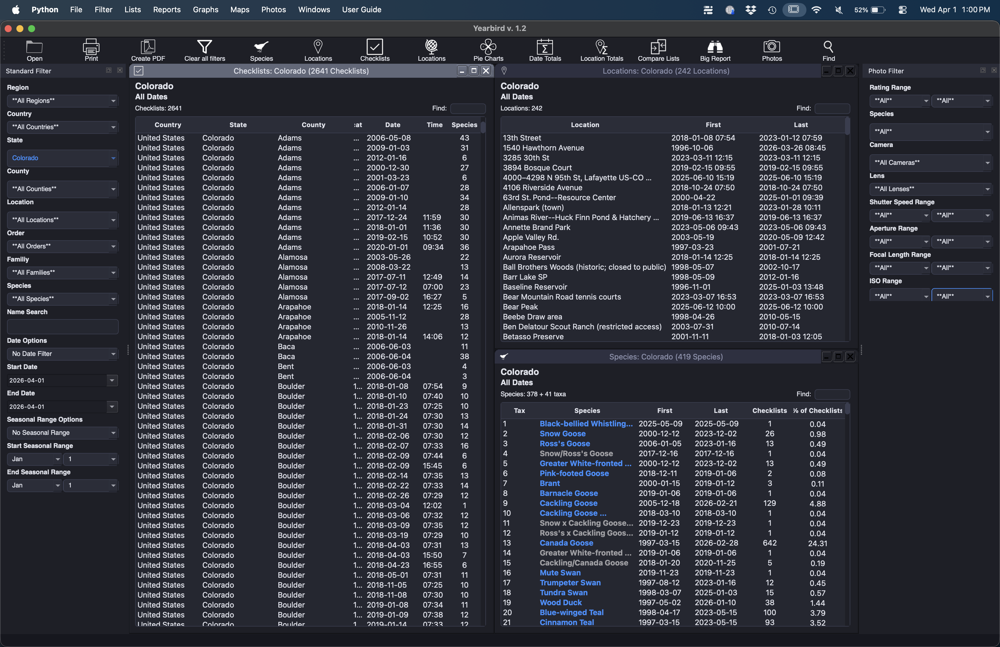
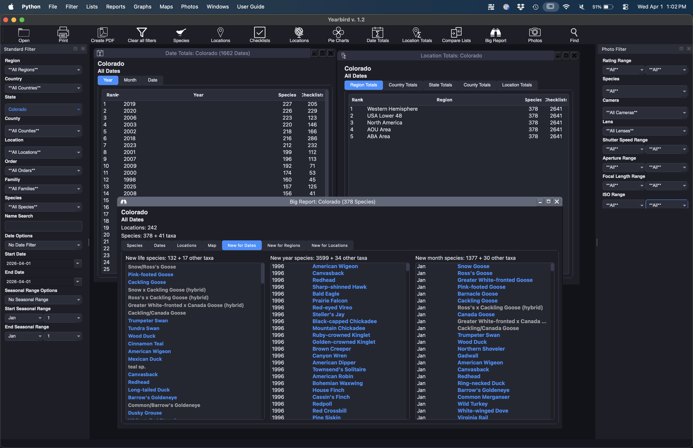
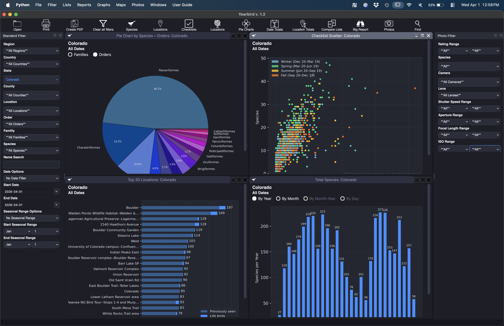
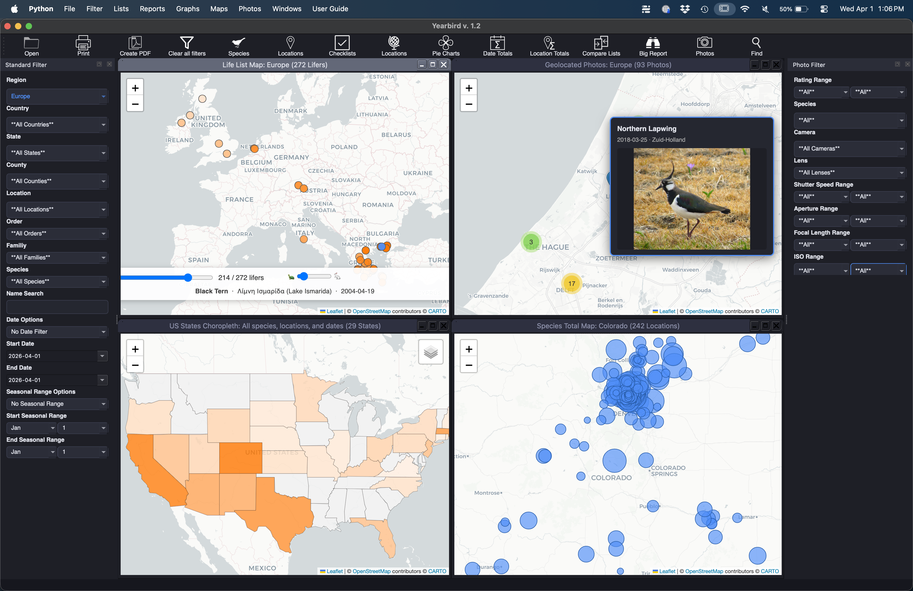
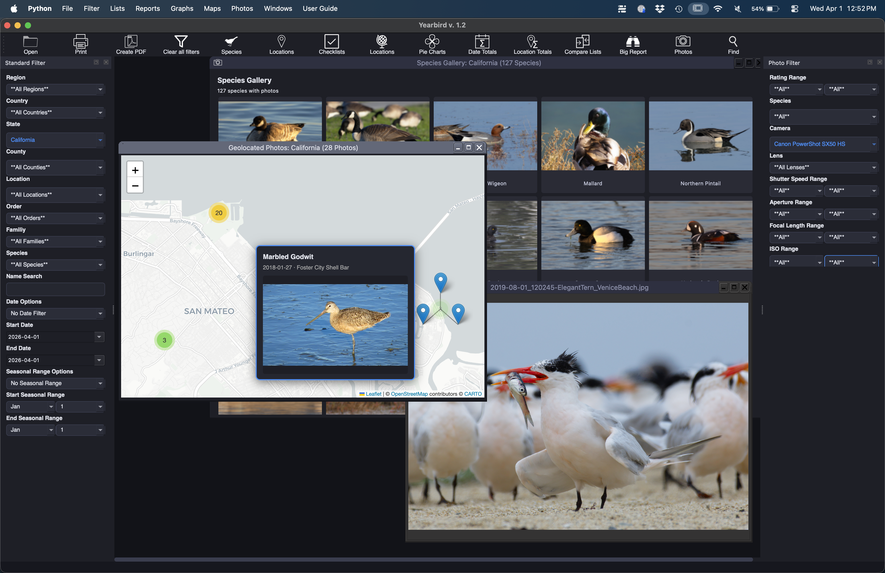

<table><tr>
<td></td>
<td></td>
<td></td>
<td></td>
<td></td>
<td></td>
</tr></table>

# Yearbirder

**Current release: v1.43** (April 2026)

A desktop application for exploring and analysing your personal [eBird](https://ebird.org) data and bird photos.

Yearbirder lets you filter, browse, and visualise your personal eBird sightings in ways the eBird website does not — across every location, species, date, and season in your personal history. If you are a bird photographer, Yearbirder also lets you sort, filter and view your photos in the same way.

---

## What's New in v1.41

- **Photo catalog safeguards** — a series of fixes prevents accidental data loss when opening, switching, or closing photo catalogs; the app now guards against overwriting an existing catalog when a new eBird data file is opened
- **No catalog, no problem** — adding photos without a catalog open now prompts you to create one before saving; if you cancel, your in-progress work is preserved and you can try again
- **Unsaved-changes protection** — closing the Manage Photos window or the photo catalog while changes are pending now asks whether to save or discard, rather than silently discarding
- **Catalog-switching guard** — opening a different photo catalog while Manage Photos is open is blocked to prevent conflicts; switching catalogs with unsaved changes prompts to save first
- **CSV catalogs must be converted** — legacy CSV photo catalogs must now be converted to the new `.jsonl` format before they can be used; the app guides you through the conversion and will not open a CSV without it
- **Default catalog tracking fixed** — declining "Set as default catalog?" now correctly preserves the previous default; the Preferences dialog always shows the stored default rather than the currently open catalog
- **Menu visibility** — the Photos menu, Close eBird Data File, and catalog-related File menu items are now shown and hidden based on what is actually open, reducing clutter

## What's New in v1.4

- **eBird species code in Rename Photos** — the Species Name Format picker now includes *eBird Species Code* (e.g. `gretit1`) alongside Common Name and Scientific Name
- **Smarter photo-to-species matching** — when adding photos to the catalog, filename matching now checks eBird codes, BBL banding codes, common names, and scientific names as substrings, handling arbitrary filename patterns from any camera or workflow; previously only whole-word token matching was used
- **Duration-aware checklist matching** — photo EXIF timestamps are now matched to the checklist whose *window* (start time + duration) is closest, so a photo taken mid-checklist correctly matches that checklist rather than the next one to start
- **Sighting Filter** — the filter panel is now labelled *Sighting Filter* to distinguish it from the Photo Filter
- **Chart names updated** — photo-related charts are now named *Families & Orders by Photos*, *Total Photos*, *New Species Photographed Each Year*, and *Photographed Species Growth Over Time*

---

## Features

- **Species, Locations, and Checklists lists** — sortable, filterable tables of your sightings
- **Individual Species window** — full sighting history, location and year breakdowns, monthly patterns, and photo thumbnails for any species
- **Location window** — complete sighting history for a single location, with species list, yearly and monthly breakdowns, and a map showing the site
- **Date Totals** — species counts by year, month, and individual date
- **Location Totals** — species counts by region, country, state, county, and named location
- **Powerful filter panel** — filter everything simultaneously by region, country, state, county, location, taxonomic order, family, species, date range, and seasonal range; the Date Options picker includes a **Select Year** mode that reveals a second dropdown listing every year in your data, so you can filter to any specific calendar year in one step
- **Big Report** — comprehensive multi-tab report combining species, dates, locations, and checklists
- **Compare Lists** — compare any two species lists side by side
- **Graphs** — fourteen chart types:
  - *Total Species Bar Graph* — species count per year
  - *Cumulative Species Curve* — cumulative species seen over time
  - *Species Heatmap* — species count by month and year
  - *Species Accumulation* — new species added each year vs. repeats
  - *Top Locations* — top 20 locations by species count
  - *Checklist Scatter* — duration vs. species count per checklist, coloured by season
  - *Locations by Species & Checklists* — locations plotted by species count vs. checklist count
  - *Species by Locations & Count* — species plotted by distinct location count vs. individual count
  - *Phenology Chart* — sighting dates by day-of-year across years
  - *First of Year Chart* — first sighting of each species per year, plotted by month
  - *Last of Year Chart* — last sighting of each species per year, plotted by month
  - *Pie Chart by Species* — species count by taxonomic family or order
  - *Pie Chart by Individual Tallies* — individual bird count by taxonomic family or order
  - *Locations by Checklists* — checklist count by location as a pie chart
  - *YTD Reports* — horizontal bar charts comparing year-to-date species, locations, checklists, and photographs across all years in your data
- **Maps** — eight interactive map types:
  - *Locations Map* — all your sighting locations plotted on a zoomable map
  - *Animated Lifer Map* — watch your life list build up chronologically, dot by dot
  - *Effort Map by Time* — bubble map sized by cumulative birding time per location
  - *Effort Map by Checklists* — bubble map sized by checklist count per location
  - *Species Total Map* — bubble map sized by species total per location
  - *Individuals Total Map* — bubble map sized by individual bird count per location
  - *Choropleth by Species* — US states, US counties, Canada, India, Great Britain, and world countries shaded by species count
  - *Choropleth by Checklists* — same regions shaded by checklist count
- **Photos** — associate your JPEG bird photos with your sightings; browse, filter, and rate them by camera, lens, aperture, shutter speed, focal length, and ISO; **File → Open Photo Catalog** defaults to the photo catalog directory stored in Preferences
  - *Browse Photos* — thumbnail gallery of every photo matching the current filter, sortable by taxonomy, date, rating, or name
  - *Species Gallery* — one best-rated photo per species, arranged in taxonomic order; click any tile to see all photos of that species
  - *Geolocated Photos* — geotagged photos plotted on a clustered interactive map; hover for a thumbnail preview, click to open the full enlargement
  - *Batch Edit Photos* — edit species, date, time, location, or rating for multiple photos at once
  - **Adding photos** — when adding photos to the catalog, Yearbirder automatically suggests the species by matching the filename against the closest checklist using the EXIF timestamp; matching checks eBird species codes (e.g. `gretit1`), BBL banding codes, common names, and scientific names as substrings, handling arbitrary filename patterns from any camera or workflow
  - **Rename Photos** — batch-rename photo files using configurable components including date, time, species name, and location; the species name component supports **Common Name**, **Scientific Name**, or **eBird Species Code** format
- **Print and PDF export** — export any window to the printer or a PDF file

---

## Download

A pre-built, signed, and notarized macOS app is available on the [Releases page](https://github.com/trinkner/yearbird/releases/latest).

Download `Yearbirder.dmg`, open it, and drag Yearbirder to your Applications folder.

---

## Requirements

- Python 3.10 or later (download from [python.org](https://www.python.org/downloads/))
- [PySide6](https://pypi.org/project/PySide6/) — Qt 6 bindings (LGPL)
- [folium](https://pypi.org/project/folium/)
- [matplotlib](https://pypi.org/project/matplotlib/)
- [numpy](https://pypi.org/project/numpy/)
- [natsort](https://pypi.org/project/natsort/)
- [piexif](https://pypi.org/project/piexif/)

After installing Python, install all other dependencies with:

```
pip install pyside6 folium matplotlib numpy natsort piexif
```

---

## Running Yearbirder

```
python3 yearbirder.py
```

---

## Getting Your eBird Data

1. Go to [https://ebird.org/downloadMyData](https://ebird.org/downloadMyData)
2. Click **Request My Observations**
3. eBird will email you a link to download a `.csv` file containing your complete sightings history
4. In Yearbirder, click **File → Open** and select that file — if you have set a default eBird data folder in Preferences, the dialog will open there automatically

---

## Building a Standalone App (macOS)

Yearbirder uses [PyInstaller](https://pyinstaller.org) to create a distributable `.app` bundle. From the project root directory:

```
pyinstaller Yearbirder.spec
```

The finished app will be in `dist/Yearbirder.app`.

---

## License

Yearbirder is free, open-source software licensed under the [GNU General Public License v3](https://www.gnu.org/licenses/gpl-3.0.html).

Created by Richard Trinkner.
